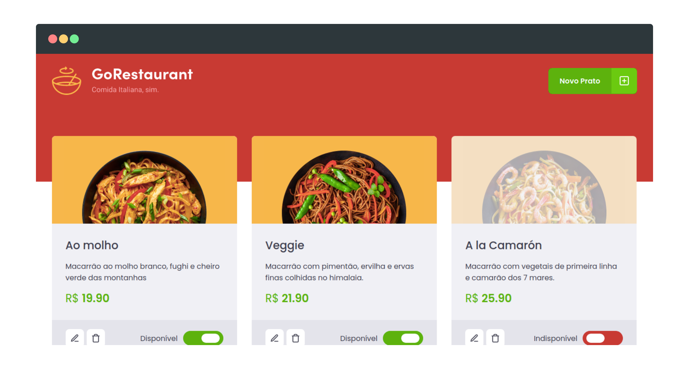
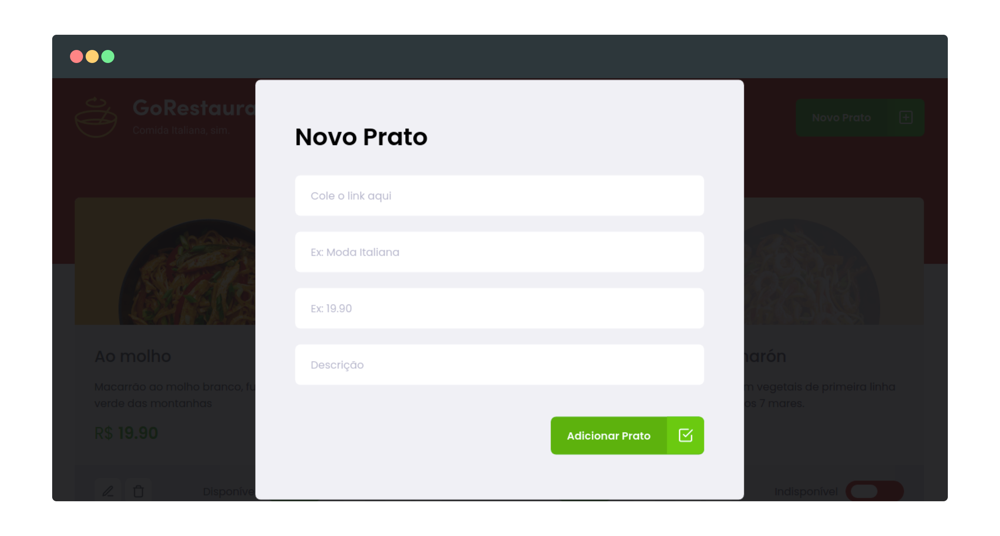

## GoRestaurante 🍕




## 🔥 Instalação

```bash
yarn install # install dependencies
yarn start # run app
yarn server # run json-server
```

> Esse repositório é um desafio do curso Ignite da Rocketseat
